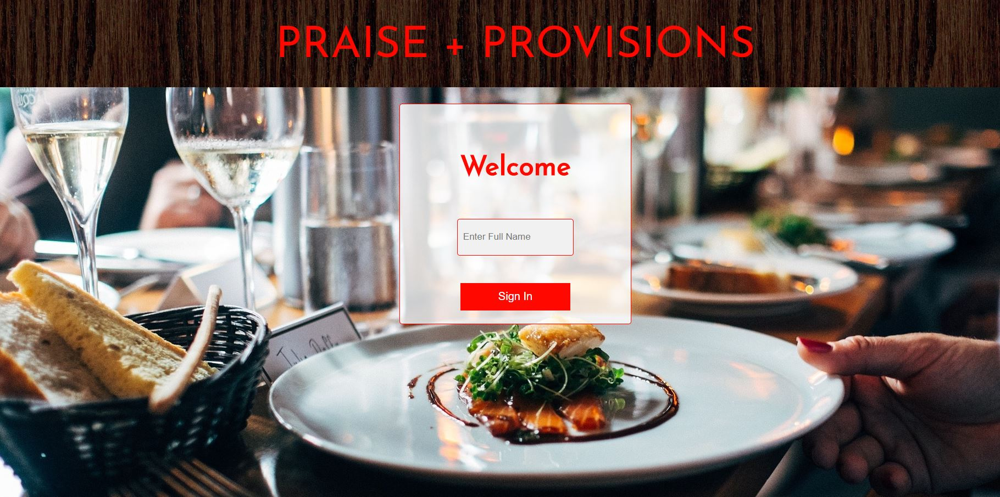
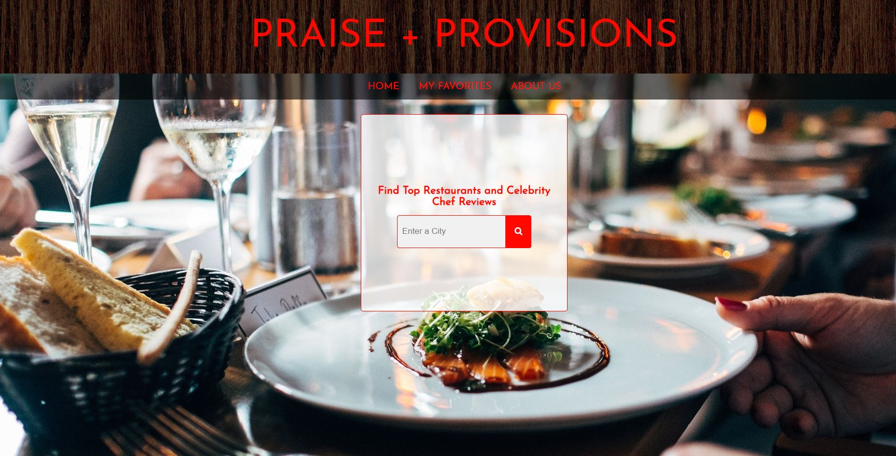
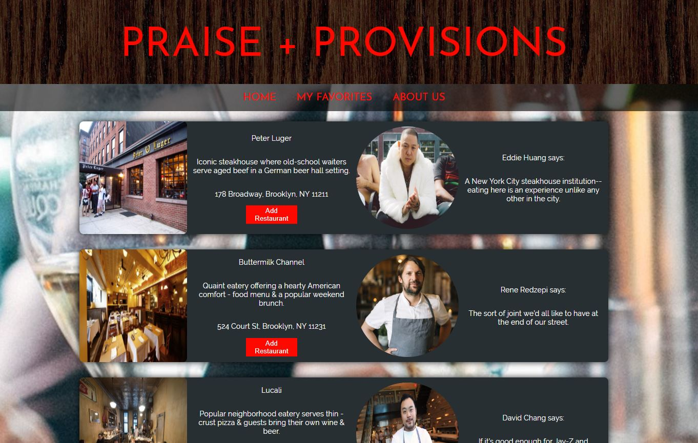
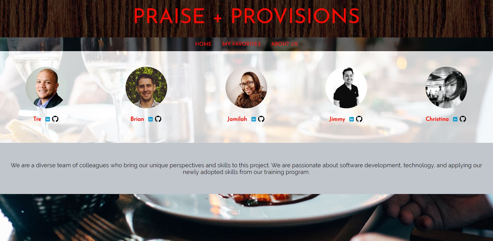

# PRAISE + PROVISIONS

Collaboratiion: Tre Cain, Jamilah McWilliams, Jimmy Nguyen, Brian Nelson, Christina Gislason

Project: Praise + Provisions

## DESCRIPTION 

Our team created an application that allows users to search top restaurants in any U.S. city and additionally receive recommendations from top celebrity chefs. 

## FRONT END WEB APP

Users login by entering their name to create a profile after which point they are directed to a search page where they can input a U.S. city to search for the top-ten rated restaurants for that given city. On the results page, the top restaurants are listed in order of popularity. If any of these listings also happen to be a celebrity recommendation, then the chef's image is shown next to that restaurant along with that chef's review for that particular restaurant. Additionally, on the results page, a user will be able to save their choice of restaurants to a 'MyFavorites' page. This information persists throughout the site and so long as the user returns under the same user profile. Lastly, an 'AboutUs' page provides some basic information each individual developer with links to their GitHub and LinkedIn profiles.

## SAMPLE VIEWS OF WEB APP

#### Login Page

#### Search Page

#### Results Page

#### About Us Page

## WEBAPP DATABASE SCHEMA

There are two tables and one join table. The Profile table contains all of the user profiles and their properties while the Restaurants table contains the same for restaurants. The join table represents the many to many relationship between the two tables.

.png)

## TOOLS USED

.NET Core, HTML/CSS, Entity Framework, SqlServer, Visual Studio Team Services, Azure DevOps

